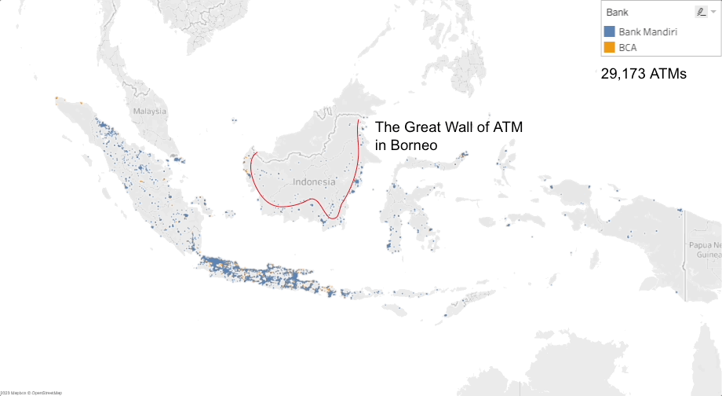

# How to get Bank Mandiri's ATM Location?

1. Download the [33 documents](https://bankmandiri.co.id/web/guest/penyesuaian-operasional-kantor-cabang)
2. Convert the PDF file as Excel file.
3. Delete every column except the address.
4. Get the Geocoding API from Google Maps.
5. Send request to Google Maps with the address.

# Insights

With a combined total of 29 thousand ATMs from BCA and Bank Mandiri. We can see 3 insights. The first one is,
The Great Wall of ATM in Borneo. As you can see, BCA’s ATMs are not present in the interior of Borneo.

The second insight is,
With 13 thousands ATMs, Bank Mandiri’s ATMs are present in every corner of Indonesia. Except,

in Bali which is BCA’s turf. There are only 2 Bank Mandiri’s ATMs are in Bali.

As you may notice, BCA has more ATMs than Bank Mandiri, which only has 13 thousand ATMs. However, BCA ATMs are not present in every corner of Indonesia. This information gives us insight into how BCA and Bank Mandiri select their ATM locations.
